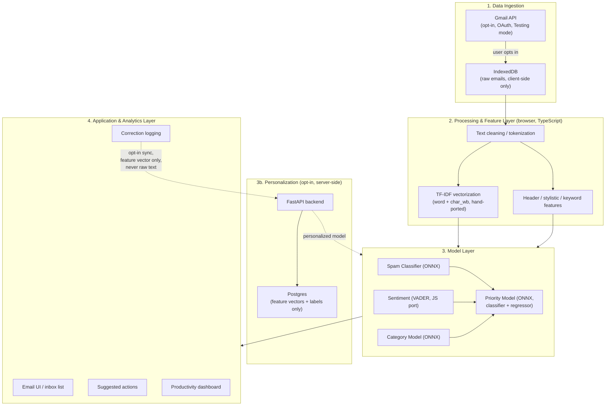

# Smart Email Management System — Application Layer Design

Status: draft, pending review
Date: 2026-08-10
Scope: `app/` only (frontend + backend). The offline ML pipeline (`scripts/`,
`models/*.joblib`, `scripts/export_onnx.py`) is out of scope — it's done,
validated, and not being touched by this design.

## 1. Context

This is the application layer for the CO3554 "Smart Email Management"
project proposal (`22ENG163_CO3554_ProjectProposalReport.pdf`). The proposal
specifies a four-layer architecture (Data Ingestion → Processing & Analytics
→ Model → Application) and a privacy requirement: email content is
classified locally, with an *optional* server-side path for user-specific
model personalization.

An earlier attempt at this layer was built and then deleted (see git
history / `PROJECT_STATUS.md`) to restart more deliberately. That attempt
did prove out the hardest technical uncertainty — whether the trained
sklearn models could actually run client-side — so this design reuses that
finding even though the code itself was discarded:

- `skl2onnx` cannot convert `char_wb`-analyzer TF-IDF at all, and its
  `word`-analyzer conversion isn't bit-exact either (measured up to a 0.016
  probability gap vs. the original sklearn model).
- Fix, already implemented in `scripts/export_onnx.py` (survived the
  deletion, lives outside `app/`): export each model *headless* (dense
  float vector in, not raw text) and hand-port the TF-IDF math itself to
  TypeScript. Verified bit-exact (0.000000 diff) against the real fitted
  vectorizers.

This design assumes that export tooling is reused as-is; the frontend TF-IDF
port, feature extraction, and ONNX wiring will be rebuilt following the same
approach, since the code (not the method) was deleted.

### 1.1 Phasing

The backend (§5.3's personalization service, §6's Postgres schema) is
strictly additive — every layer that delivers the proposal's actual value
(classify, prioritize, inbox, suggested actions, dashboard) runs entirely
client-side already. Nothing in the backend is load-bearing for a working
demo. So this is built in two phases:

- **Phase 1 — frontend only.** Everything in §2's diagram except the
  "3b. Personalization" subgraph and its backend/DB nodes. This includes
  full correction logging (§5.4) — corrections always write to IndexedDB
  first regardless of personalization, so that UX works in phase 1, it just
  has nothing to sync to yet. Custom categories (§5.4, §6) are built now
  too, but **disabled/grayed out** with a note that they need phase 2 to
  actually classify anything into them — the data model and UI shell exist
  from the start, so phase 2 doesn't require rework, just un-graying a
  feature and pointing it at a real endpoint.
- **Phase 2 — backend.** The personalization service (§5.3), its Postgres
  schema (§6), and wiring the phase-1 UI's disabled affordances (sync
  toggle, custom-category creation) to it.

Everything else in this document (architecture, components, schema, privacy
boundary, error handling, testing) describes the target end state across
both phases; section text doesn't repeat "phase 1 / phase 2" per item
except where the distinction actually changes behavior (see §5.4).

## 2. Architecture overview

Layer responsibilities, matching the proposal's own structure:

1. **Data Ingestion** — Gmail API, opt-in per the proposal's own "if user
   agrees" gate. Fetched email content is stored client-side (IndexedDB)
   only.
2. **Processing & Feature Layer** — runs entirely in the browser
   (TypeScript). This is what makes the proposal's "processed locally"
   requirement literally true rather than aspirational.
3. **Model Layer** — four ONNX models (spam, category, priority classifier,
   priority regressor) run client-side via `onnxruntime-web`, with the same
   feature dependencies as `scripts/classify_email.py`: spam and category
   are each computed independently from the cleaned text + header/style
   features; priority then combines spam's confidence, category's label,
   VADER sentiment, and keyword/header features — it's the only model that
   depends on another model's output.
4. **Application & Analytics Layer** — inbox UI, suggested actions,
   dashboard, feedback logging. This layer barely existed in the deleted
   attempt (a bare single-email classify form) — it's the main net-new
   scope of this restart.

## 3. Language & platform choices

| Concern | Choice | Rationale |
|---|---|---|
| Training pipeline | Python | Already built (`scripts/`), out of scope here |
| Backend | Python (FastAPI) | Matches proposal's stated primary language; shares tooling with training scripts if ever needed |
| Frontend + inference | TypeScript | Mandatory — browser-only execution is the privacy requirement itself; strict typing catches silent numeric drift in feature-vector code, where a slip produces a wrong prediction, not a crash |
| Frontend hosting | Vercel | Zero-config Vite/React deploys; no ML server to host since inference is 100% client-side |
| Backend + DB hosting | Render (Postgres add-on) | One platform for backend+DB, free tier, deploys from the existing `Dockerfile` |
| Local dev | Docker Compose (Postgres + Adminer + backend) | Unchanged from before |
| Gmail access | Google Cloud OAuth client, **Testing** publish status | Caps at 100 test users but skips Google's verification review — doesn't fit the course timeline otherwise |
| Source control / CI | GitHub | Needed to connect Vercel + Render auto-deploy |

## 4. Deviations from the literal proposal (and why)

| Proposal says | This design does | Why |
|---|---|---|
| BERT for complicated/ambiguous emails | No transformer model | Tested (MiniLM embeddings) in an earlier session and found to *underperform* TF-IDF+headers (72.2% vs. 73.6% CV) — and independently, a fine-tuned transformer is 60-90MB+, needs a heavy WASM runtime, and conflicts with running client-side at all. Rejected on both accuracy and architecture grounds. |
| Random Forest **and** XGBoost | Random Forest only (priority bucket) | RF was tested against plain LogisticRegression and won (74.8% vs 70.0%); XGBoost specifically was never tried. Documented as a known gap, not silently dropped. |
| MongoDB | Postgres | The proposal's own rationale for Mongo is "email content is semi-structured" — but in this design raw email content never reaches the server at all (stricter than the proposal's own diagram, which still routes email through a server-visible Model Layer box). The backend only ever stores structured, relational data (users, corrections-as-feature-vectors, custom categories, model versions) — Postgres's shape, not Mongo's. Already decided in an earlier session ("let's do postgres"), reaffirmed here with the reasoning made explicit. |

## 5. Components

### 5.1 Data Ingestion
- **Gmail OAuth flow** — frontend-initiated, backend never sees the access
  token directly if avoidable (standard OAuth code flow); refresh token
  handling TBD in implementation planning (out of scope for this design's
  detail level — flagged as an open question in §10).
- **Email fetch** — pull subject/body/headers via Gmail API, store in
  IndexedDB. No server round-trip for raw content.

### 5.2 Processing & Feature Layer (`app/frontend/src/inference/`)
Rebuilding the deleted-but-proven pieces:
- `features.ts` — `cleanText`, header features (recipient count,
  reply/forward flag, sender-automated pattern), keyword features
  (urgency/deadline/bulk-mail regex counts)
- `stylistic.ts` — formal/informal tone markers (greeting/closing style,
  caps density, exclamation density, question count)
- `tfidf.ts` — hand-ported word + `char_wb` TF-IDF, matching sklearn's
  algorithm exactly (tokenization, stopword removal, n-grams, sublinear tf,
  idf, L2 norm)
- `sentiment.ts` — VADER via the `vader-sentiment` npm package

### 5.3 Model Layer (`app/frontend/src/inference/engine.ts`)
- Loads 4 ONNX models + their `*.vocab.json` sidecars (vocabulary, idf,
  scaler mean/scale, category one-hot order) from `public/models/`,
  generated by `scripts/export_onnx.py`
- Runs spam and category independently (both need only text + header/style
  features), then priority (classifier + regressor) last, once spam's
  confidence, category's label, and sentiment are all available — matching
  `classify_email.py`'s actual feature dependencies, not a strict linear
  pipeline
- **Personalization (opt-in, server-side):** small FastAPI service —
  receives only `{label_type, original_label, corrected_label,
  custom_category_name, feature_vector}`, never subject/body. Uses
  centroid/kNN for low-volume custom categories, promotes to a full
  retrained model past a per-category example threshold. (This logic was
  already designed and scaffolded in the deleted attempt — rebuild is
  mechanical, not a new design decision.)

### 5.4 Application & Analytics Layer — net-new scope
- **Inbox UI** — list view of fetched/classified emails (subject, sender,
  category badge, priority badge, sentiment indicator)
- **Suggested actions** — derived, not modeled: a simple rule mapping
  `(category, priority, spam)` → one of {reply, archive, flag, ignore}.
  Not a new ML component — proposal asks for "suggested actions," not a
  learned action-recommendation model.
- **Productivity dashboard** — charts over the user's classified-email
  history: category breakdown, priority distribution over time, sentiment
  trend. Client-side aggregation over IndexedDB data (no server round-trip
  needed, since the raw classification results already live locally).
- **Feedback logging** — correction UI (user overrides a label), stored
  locally always, synced to the backend only if personalization is enabled.
- **Custom category creation** — UI and IndexedDB storage (`customCategories`)
  built in phase 1; the "create" action is disabled/grayed with an inline
  note ("enable personalization to let a custom category actually classify
  emails") until phase 2 wires it to the backend's centroid/kNN retraining.

## 6. Storage & schema

**Client (IndexedDB, via `idb`):**
- `emails` — fetched email content + classification results
- `corrections` — user label overrides, `synced: boolean` flag
- `customCategories` — user-defined categories beyond Work/Personal/Other

**Server (Postgres):**
- `users` — `id`, `email`, `personalization_enabled`
- `custom_categories` — `id`, `user_id`, `name`
- `corrections` — `id`, `user_id`, `label_type`, `original_label`,
  `corrected_label`, `custom_category_id`, `feature_vector` (JSONB),
  `used_in_training`
- `model_versions` — `id`, `user_id`, `model_type`, `strategy`
  (`centroid`/`knn`/`retrained`), `training_example_count`, `artifact`
  (JSONB)

(This schema matches what was already designed and scaffolded in the
deleted attempt — carried forward, not redesigned.)

## 7. Privacy boundary

Restated precisely, since it's the load-bearing requirement from the
proposal:
- Raw subject/body **never** leaves the browser, under any circumstance.
- The *only* thing that can ever reach the backend is a correction event
  shaped as `{label_type, original_label, corrected_label,
  custom_category_name, feature_vector}` — and only if the user has
  explicitly opted into personalization.
- `feature_vector` is numeric (TF-IDF weights + header/style/keyword
  numbers) — reconstructing the original email text from it is not
  practically possible with the granularity this project sends (aggregate
  TF-IDF weights over a large fixed vocabulary, not raw token sequences).

## 8. Error handling

- **Models fail to load** (missing/corrupt ONNX or vocab JSON) — surfaced
  as a blocking error state in the UI, not a silent fallback to wrong
  predictions. (Same principle the deleted `App.tsx` already followed.)
- **Gmail API failures** (token expiry, rate limit, revoked access) —
  standard OAuth re-auth prompt; classification of already-fetched local
  emails continues to work offline regardless.
- **Personalization sync failures** — corrections stay queued locally
  (`synced: false`) and retry on next sync attempt; never block local
  classification or UI.

## 9. Testing strategy

- **TF-IDF / feature parity** — reuse the verification approach already
  proven: Python fixtures dumped from the real fitted vectorizers, cross-
  checked against the TS port via a Node harness. Target: 0.000000 diff,
  as achieved before.
- **End-to-end pipeline parity** — reuse `classify_email.py`'s own test
  emails as a golden set; a Node script runs the same emails through the
  full TS pipeline + ONNX models and diffs the output against Python's.
- **Backend** — standard FastAPI `TestClient` tests per route (health,
  corrections, categories, personalization) — matches the already-
  scaffolded `tests/test_health.py` pattern.
- **Manual browser verification** — explicitly called out as *not yet
  done* on the previous attempt (Node was used as a stand-in for
  onnxruntime-web) — this restart should include an actual browser
  click-through before considering any milestone complete.

## 10. Open questions (not resolved by this design, flagged for implementation planning)

- Exact Gmail OAuth token-handling flow (where the access token is
  minted/refreshed, whether the backend is involved at all given the
  client-side-only inference model)
- Whether the dashboard needs any server-side aggregation, or stays 100%
  client-side over IndexedDB (current assumption: fully client-side)
- Personalization retrain trigger mechanics (background job vs. on-demand
  endpoint) — was a stub in the deleted attempt, not fully designed there
  either

## 11. What's reused vs. rebuilt

| Already exists, reused as-is | Rebuilt from scratch (design proven, code deleted) |
|---|---|
| `scripts/` — full ML training pipeline | `app/frontend/` — entire frontend |
| `models/*.joblib` — trained models | `app/backend/` — entire backend |
| `scripts/export_onnx.py` — ONNX export + vocab JSON sidecars | `app/frontend/scripts/e2e_check.mjs`, `verify_tfidf.ts` — verification harnesses |
| `scripts/dump_tfidf_fixtures.py` — parity fixture generator | `docker-compose.yml` |
